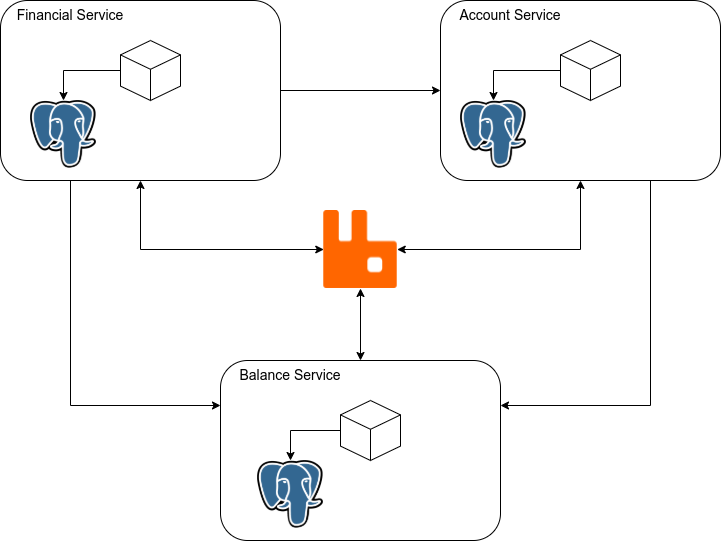

## Balance Service

Balance Service é o serviço responsável por gerenciar o saldo das contas.

O projeto deve ser o primeiro, tendo em vista que ele é o responsável por iniciar o container do RabbitMQ e as networks compartilhadas entre os serviços.

Assim, basta clonar o repositório e executar o comando abaixo na pasta raiz:

```text
$ sudo docker-compose  up --build
```

O comando acima irá realizar o build da imagem e iniciar os containers do projeto.  

Em seguida, poderá ser feito o start de qualquer outro serviço. Para isso, basta clonar cada um dos projetos e realizar o mesmo comando acima na pasta raiz correspondente ao projeto.

## Funcionamento:

O serviço é capaz de criar um saldo referente a uma conta, consultar o saldo atual da conta e atualizar o saldo.

Ao realizar a criação de um saldo, o serviço irá iniciá-lo com o valor 0.00. 

E sempre que for desejado fazer uma atualização, primeiramente é feito a criação de um saldo transitório que posteriormente é utilizado para fazer o cálculo com o saldo atual e atualizá-lo.

Além disso, ao consultar o saldo, sempre será considerado os saldos que ainda estão para ser de fato efetivado e o saldo atual da conta.



## Endpoints:

1. POST /balances/{accountId}

   Endpoint responsável por realizar a criação do saldo de uma determinada conta. Se a conta já possuir o saldo criado, não é realizado alteração alguma. É necessário passar o accountId na URL, referente a conta que deverá ser criada o saldo. Além disso, o envio do seguinte payload é requisitado:
   
   
   ```java
   {
      "accountId": 1
   }
   ```
   
2. GET /balances/{accountId}

   Endpoint responsável por consultar o saldo de uma conta, específicada no parâmetro da URL como accountId. O serviço irá buscar todos os saldos que ainda não foram calculados e atualizados na tabela auxiliar, além de consultar o saldo atual. Em seguidá irá devolver o valor estimado do saldo final da conta.
    
   
3. PUT /balances/{accountId}

    Endpoint responsável por atualizar o saldo de uma conta, específicada no parâmetro da URL como accountId. Nessa chamada, o serviço irá inserir o balanço transitório numa tabela auxiliar na base de dados e em seguida inserir na fila para que o balanço possa ser calculado e atualizado efetivamente. Além do parâmetro, o envio do seguinte payload é requisitado:
   

   ```java
   {
      "accountId": 1   
      "balanceValue": 1.00
      "operationType": "CREDIT"
   }
   ```   

#### Links:

1. [financial-service](https://github.com/Felipecan/financial-service.git)

2. [account-service](https://github.com/Felipecan/account-service.git)